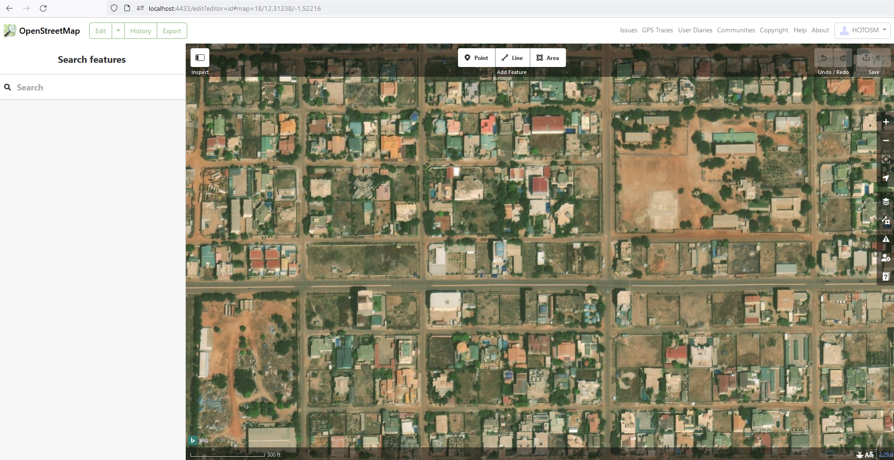

# OSM Sandbox

> [!IMPORTANT]  
> This project was a demo / prototype to easily set up a sandboxed
> OSM instance on demand, with minimal config required.
>
> The goal was to contribute any changes made here to the
> [osm-seed](https://github.com/developmentseed/osm-seed/) repository.
>
> There has since been additional work done on OSMUS's Sandbox
> [implementation](https://github.com/osmus/osm-sandbox-dashboard), which
> will likely be used in conjunction with osm-seed or
> [Public Domain Map](https://github.com/publicdomainmap/api).
>
> This repo is now archived & work / contribution will continue on the
> linked repos.

An easy install sandboxed version of OpenStreetMap, for collaborative editing
in an isolated environment.

This repository does the following:

- Builds a custom lightweight container image for OpenStreetMap.
- Automatically configures an admin user, OAuth application, and working ID Editor.
- Starts a sandboxed / isolated instance of OpenStreetMap from the main instance at
  openstreetmap.org.



## Usage (Development)

```bash
git clone https://github.com/hotosm/osm-sandbox.git
cd https://github.com/hotosm/osm-sandbox.git
docker compose up -d
```

Access OpenStreetMap on: http://localhost:4433
Access ID Editor on: http://localhost:4433/edit?editor=id

Credentials:
- User admin@hotosm.org
- Password: Password1234

## Usage (Production)

- Buy a domain and allocated a server.
- Run the interactive install script:

    ```sh
    curl --proto '=https' --tlsv1.2 -sSf https://get.sandbox.hotosm.dev | bash
    ```

## Importing Existing OSM Data

[osm_to_sandbox](https://github.com/Zverik/osm_to_sandbox/tree/main) is bundled
in the container.

To import a specific bounding box from production OSM (via the Overpass API),
add the following environment variable to your `.env` file:

```dotenv
# Change the bbox string using a tool like https://boundingbox.klokantech.com
IMPORT_BBOX: "32.189941,15.159625,32.961731,15.950766"
```
